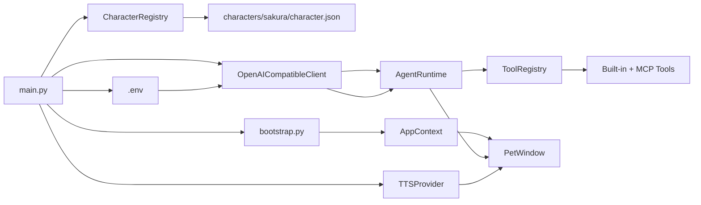

[中文](README.md)

# Sakura Desktop Pet

A desktop character Agent that stays on-screen, chats, expresses emotions with portraits, speaks through optional TTS, remembers what you allow it to remember, and uses tools after confirmation when tasks need more than text.


## Design Philosophy

Most AI chat apps are still just text boxes that answer questions. Sakura is built for a different experience: a character remains on your desktop, speaks in her own voice, reacts with portraits, can set reminders, read web pages, and, when allowed, look at the current screen.

The model returns replies as bilingual JSON segments (Japanese original + Chinese subtitles + tone label). The UI synchronizes subtitles, portraits, and optional TTS around the same reply structure.

## Key Capabilities

- **Character packages.** `CharacterRegistry` scans `characters/*/character.json`, validates character cards, portraits, and voice resources. Adding a new character is mostly adding a new package directory.

- **Segmented bilingual replies.** The model returns JSON segments — each with `ja`, `zh`, and `tone`. The UI uses the same structure to display subtitles, switch portraits, and play TTS.

- **Tone-driven portraits and voice.** Tone labels simultaneously drive portrait switching and TTS reference audio selection, with GPT-SoVITS weight support.

- **Agent tool loop.** `AgentRuntime` first plans whether tools are needed, executes built-in or MCP tools (todos, reminders, notes, memory, browser, screen observation, etc.), then generates the final reply from tool results.

- **On-demand screen observation.** The model can request a single screen capture per turn, sent as an OpenAI-compatible `image_url` message; screenshots are never written to chat history.

- **Autonomous screen observation.** When enabled, the model can autonomously decide whether to observe the screen during conversations or proactive events.

- **Proactive care.** Periodically initiates conversation based on context, optionally including screen context as topic material. Supports batch observation snapshots.

- **Manual screenshot.** Select a screen region manually and send it to the model.

- **Controlled browser.** Sakura can open an app-managed browser page, extract text/links, scroll, and click CSS selectors. State-changing actions require confirmation.

- **Local desktop operations.** Mouse clicks, text input, and other desktop actions via MCP Windows tools, useful for browser interactions and accessibility.

- **Long-term memory with candidate confirmation.** Todos, reminders, notes, and memory live under `data/`. Long-term memory is written as candidates first — only written to permanent memory after explicit user confirmation.

- **Automatic memory curation.** After a configurable number of conversation turns, the model automatically extracts and organizes key facts from history as memory candidates.

- **History review and backtracking.** View past conversations and backtrack from any historical point to continue the conversation.

- **MCP extension.** `data/config/mcp.yaml` registers stdio or SSE MCP servers. External tools are prefixed, added to the tool registry, and gated by risk level. Supports runtime toggles (e.g., Windows MCP).

- **Portrait animations.** Fade-in/out, bounce, and other transition effects for character portraits, paired with a frosted-glass style bubble.

- **Context trimming.** Long conversations are automatically trimmed to stay within model limits.

- **Debug logging.** Detailed debug logs with request/response summaries for development troubleshooting.

## With and Without Sakura

| Without Sakura | With Sakura |
|---|---|
| Chat happens in a normal text window | The character stays as a desktop pet |
| Replies are plain text blobs | Replies become display/voice/expression segments |
| Expressions and voice are separate | Tone labels drive both portraits and TTS references |
| Tool use requires manual app switching | The model plans and calls tools in conversation |
| Screen capture becomes persistent data | Screenshots attach only to the current turn; history stores only a marker |
| External abilities must be hard-coded | MCP servers connect through YAML |
| Memory can be silently written by the model | Candidate memory requires explicit confirmation |
| No proactive conversation | Periodic proactive care based on config |

## Startup Flow

When you run `python main.py`:

1. Creates `QApplication`
2. Loads API config from `.env` via `ApiSettings.load()`
3. `CharacterRegistry` scans character packages
4. Loads persona card and available tones/portraits
5. `bootstrap.py` assembles `AppContext` — tool registry, memory/reminder stores, MCP bridge, memory curator, proactive care config, TTS provider
6. Shows `PetWindow`



## Conversation & Tool Call Flow

`PetWindow.send_message()` adds user input to context and starts `ChatWorker` in a `QThread`. The Worker calls `AgentRuntime.handle_user_message()`:

1. Model first returns tool call intent or reply
2. If tool calls → execute → return results to model → model outputs segmented reply
3. Segmented reply is parsed as `ChatReply` and emitted via signals to the UI thread
4. UI displays subtitles, switches portraits, and plays TTS segment by segment

Tool confirmation flow: when a tool has risk level `medium` or `high` and free access is off, `PendingToolAction` shows a confirmation panel for user decision. After confirmation, the Worker continues with the result.

## Project Structure

```text
.
├── main.py                         # Application entry point
├── config.example.env              # Example config
├── app/
│   ├── api_client.py               # OpenAI-compatible chat/completions client
│   ├── app_context.py              # Dependency container
│   ├── bootstrap.py                # Startup assembly
│   ├── character_loader.py         # Character package scanning & validation
│   ├── chat_history.py             # Chat history storage
│   ├── chat_reply.py               # Segmented reply parsing & fallback
│   ├── chat_worker.py              # Qt background thread Worker
│   ├── context_trimming.py         # Long-context trimming
│   ├── debug_log.py                # Debug logging
│   ├── env_config.py               # .env read/write
│   ├── history_window.py           # History review window
│   ├── pet_window.py               # Main pet window (tray, subtitles, portraits, tool confirmation)
│   ├── portrait_utils.py           # Portrait utilities
│   ├── proactive_care.py           # Proactive care module
│   ├── prompt_templates.py         # Prompt templates (Agent protocol, context strategy, event protocol)
│   ├── screen_observation.py       # Screen observation (auto + manual)
│   ├── settings_dialog.py          # Settings dialog
│   ├── tts.py                      # GPT-SoVITS / Mute Provider
│   ├── visual_observation.py       # Visual observation record store
│   ├── agent/
│   │   ├── actions.py              # Agent action/event/pending data structures
│   │   ├── builtin_tools.py        # Built-in tool registry
│   │   ├── desktop_tools.py        # Local desktop tools (notes, open folder/URL)
│   │   ├── memory.py               # Long-term memory & candidate memory
│   │   ├── memory_curator.py       # Automatic memory curation
│   │   ├── memory_curation_worker.py # Memory curation background Worker
│   │   ├── reminders.py            # One-shot reminders
│   │   ├── runtime.py              # Agent decision, tool calls, final reply
│   │   ├── screen_policy.py        # Screen observation policy
│   │   ├── screen_tools.py         # Screen observation tool
│   │   ├── tool_policy.py          # Tool routing policy (browser/desktop/web)
│   │   ├── tool_registry.py        # Tool registry, permissions & execution
│   │   └── mcp/
│   │       ├── bridge.py           # MCP tool bridge
│   │       ├── config.py           # MCP YAML config model
│   │       ├── provider.py         # MCP lifecycle management
│   │       ├── settings.py         # MCP runtime toggle
│   │       └── web_search_server.py# Web search MCP Server
│   ├── ui/
│   │   ├── fonts.py                # Font config
│   │   ├── frosted_glass_frame.py  # Frosted glass window component
│   │   ├── manual_screenshot_overlay.py # Manual screenshot overlay
│   │   ├── portrait_controller.py  # Portrait controller (animations)
│   │   ├── screen_capture.py       # Screen capture utility
│   │   ├── styles.py               # Unified stylesheet
│   │   ├── subtitle_controller.py  # Subtitle controller
│   │   ├── tool_confirmation_panel.py # Tool confirmation panel
│   │   └── tray_menu.py            # Tray menu
│   └── voice/
│       ├── playback_controller.py  # Voice playback controller
│       └── __init__.py
├── characters/
│   └── sakura/
│       ├── character.json          # Character manifest
│       ├── card.md                 # Persona card / system prompt
│       ├── portraits/              # Tone portraits
│       └── voice/                  # Model files & reference audio
├── data/                           # Local data (history, memory, reminders, todos, notes, MCP config)
└── tests/                          # pytest tests
```

## Quick Start

**Prerequisites:** Python 3.10+. On Windows, use PowerShell:

```powershell
# 1. Create and activate venv
python -m venv .venv
.\.venv\Scripts\Activate.ps1

# 2. Install dependencies
pip install -r requirements.txt

# 3. Create local config
Copy-Item config.example.env .env

# 4. Edit .env, at least fill in API_KEY
notepad .env

# 5. Launch pet
python main.py
```

**Minimal .env:**

```env
BASE_URL=https://api.openai.com/v1
API_KEY=your_api_key_here
MODEL=gpt-4.1-mini
CURRENT_CHARACTER_ID=sakura
TTS_ENABLED=false
```

After startup, you should see 夜乃桜 near the bottom-right of your screen. Right-click the pet or tray icon to access settings, history, subtitle language, privacy toggles, model vision toggle, free access, and exit.

## Optional Voice Setup

Voice is disabled by default. The repository includes GPT-SoVITS client integration and Sakura's character voice config, but does not bundle the GPT-SoVITS server runtime. Start your own local GPT-SoVITS API compatible with:

- `POST /tts`
- `GET /set_gpt_weights`
- `GET /set_sovits_weights`

Then enable in `.env` or settings:

```env
TTS_ENABLED=true
GPT_SOVITS_API_URL=http://127.0.0.1:9880/tts
GPT_SOVITS_REF_LANG=ja
GPT_SOVITS_TEXT_LANG=ja
GPT_SOVITS_TIMEOUT_SECONDS=60
```

The bundled Sakura character package already configures GPT/SoVITS model paths and tone reference tables in `characters/sakura/character.json`.

## Configuration

| Key | Purpose | Default |
|---|---|---|
| `BASE_URL` | OpenAI-compatible API base URL | `https://api.openai.com/v1` |
| `API_KEY` | API key for chat requests | empty |
| `MODEL` | Chat model name | `gpt-4.1-mini` |
| `API_TIMEOUT_SECONDS` | Chat request timeout | `60` |
| `SUBTITLE_LANGUAGE` | Bubble language (`ja` or `zh`) | `ja` |
| `SCREEN_OBSERVATION_ENABLED` | Allow on-demand screen observation | `true` |
| `AUTONOMOUS_SCREEN_OBSERVATION_ENABLED` | Allow model to autonomously request screen | `false` |
| `PROACTIVE_CARE_ENABLED` | Enable proactive care | `false` |
| `PROACTIVE_SCREEN_CONTEXT_ENABLED` | Include screen context in proactive care | `false` |
| `PROACTIVE_CHECK_INTERVAL_MINUTES` | Proactive care check interval (min) | `20` |
| `PROACTIVE_COOLDOWN_MINUTES` | Proactive care cooldown (min) | `10` |
| `AUTO_MEMORY_ENABLED` | Enable automatic memory curation | `true` |
| `AUTO_MEMORY_TRIGGER_TURNS` | Turns between memory curation triggers | `8` |
| `AUTO_MEMORY_BACKFILL_LIMIT` | Max messages to backfill when curating | `200` |
| `WINDOWS_MCP_ENABLED` | Enable Windows desktop operation MCP | `false` |
| `SAKURA_DEBUG` | Enable debug logging | `false` |
| `SAKURA_DEBUG_BODY` | Log full request/response body in debug | `false` |
| `CURRENT_CHARACTER_ID` | Current character package id | `sakura` |
| `TTS_ENABLED` | Enable GPT-SoVITS voice | `false` |
| `GPT_SOVITS_API_URL` | Local TTS API URL | `http://127.0.0.1:9880/tts` |
| `GPT_SOVITS_REF_LANG` | Reference audio language | `ja` |
| `GPT_SOVITS_TEXT_LANG` | TTS input text language | `ja` |
| `GPT_SOVITS_TIMEOUT_SECONDS` | TTS request timeout | `60` |

## Tests

```powershell
python -m pytest
```

Tests cover API client, Agent core pipeline, chat Worker, debug logging, pet window, TTS, history window, memory curation, visual observation, and web search MCP.

## License

No root `LICENSE` file is included yet. Check the license of character assets, model weights, and third-party runtimes before redistribution.
