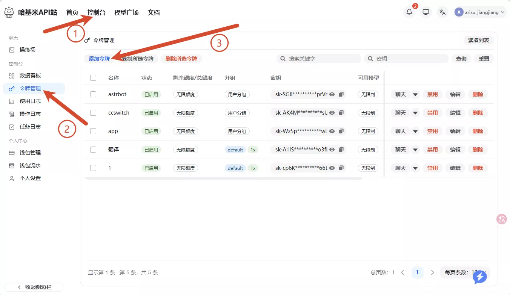
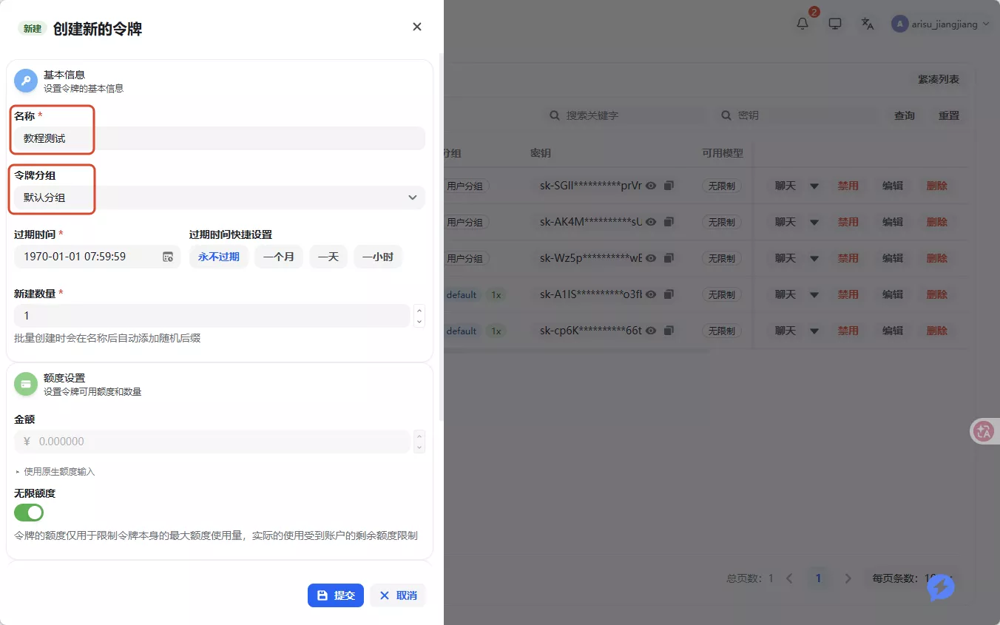
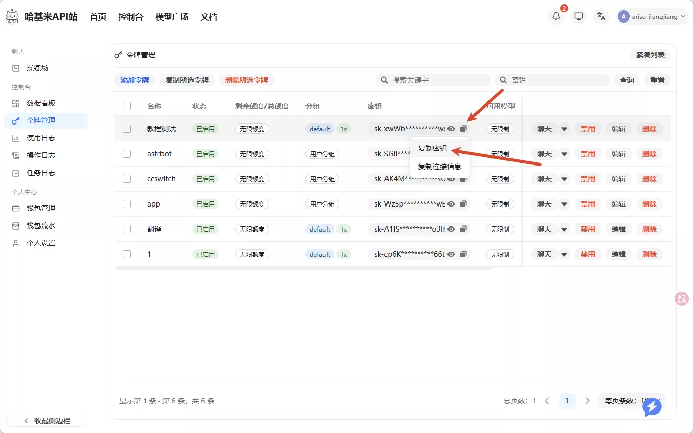
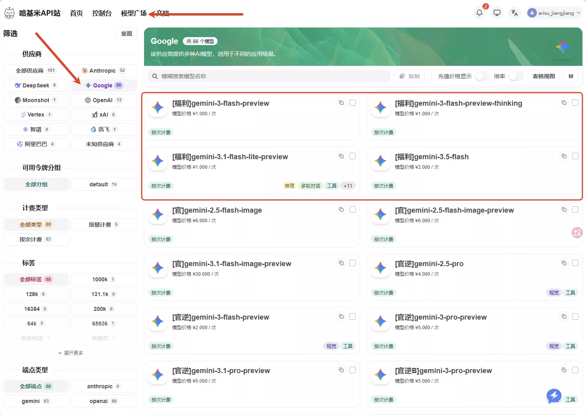

# Sakura API 配置教程

本文教你在 Sakura 中配置大模型 API。

Sakura 使用 OpenAI 兼容接口连接大模型。配置时只需要准备 3 个信息：

| 配置项 | 填什么 |
|---|---|
| `Base URL` | 服务商提供的 OpenAI 兼容接口地址，通常以 `/v1` 结尾 |
| `API Key` | 服务商生成的密钥 |
| `模型` | 服务商模型列表中的模型名称 |

> Sakura 需要模型支持图像输入（屏幕观察等功能会把截图发给模型）。推荐 Gemini Flash 系列。DeepSeek 系列作为主模型时，截图识别等功能会报错。

---

## 使用中转站配置

下面以[哈基米 API](https://api.gemai.cc/register?aff=rwbQ) 站为例。你也可以使用其他 OpenAI 兼容服务商，只要能拿到 `Base URL`、`API Key` 和模型名称即可。

### 第一步：注册账号

进入[哈基米 API](https://api.gemai.cc/register?aff=rwbQ)

可以用 QQ 邮箱注册。新用户有免费额度测试，之后需要再充值。

### 第二步：创建令牌

登录后进入**控制台**，在左侧选择**令牌管理**，点击**添加令牌**。



创建令牌时：

- **名称**：随便填写一个容易识别的名字，例如 `sakura`
- **令牌分组**：保持默认分组即可
- **过期时间**：选不过期，后续需要时再删除或重建
- **额度设置**：保持默认即可



创建完成后回到**令牌管理**页面，点击密钥右侧的复制按钮，复制刚创建的密钥。



密钥通常以 `sk-` 开头。不要把完整密钥截图发到公开群、Issue 或社交平台。

### 第三步：挑选模型

进入**模型广场**，选择 Google 供应商，优先选择 Gemini Flash 系列。



示例模型名：

```text
[福利]gemini-3.5-flash
```

不同模型的计费方式和价格不同。桌宠会在聊天、主动观察、工具调用等场景请求模型，长时间运行会消耗额度。

### 第四步：填写 Sakura 设置

打开 Sakura 的**设置**窗口，进入**模型**页面。


按下面填写：

| 字段 | 示例 | 说明 |
|---|---|---|
| `Base URL` | `https://api.gemai.cc/v1` | 填到 `/v1` 这一层，不要填到 `/chat/completions` |
| `API Key` | `sk-...` | 粘贴刚才复制的令牌密钥 |
| `模型` | `[福利]gemini-3.5-flash` | 填模型广场里的完整模型名称 |
| `超时` | `60 秒` | 保持默认即可 |

填写完成后，点击**检测模型**。如果服务商有 `/models` 接口，Sakura 会读取可用模型列表供选择。再点击**测试 API**，弹出成功提示后点击 **Save** 保存。

---

## 配置完成后验证

1. 在设置页点击**测试 API**，确认能返回成功提示。
2. 保存设置并回到主界面。
3. 发送一句普通消息，确认 Sakura 能回复。
4. 使用一次屏幕观察相关功能，确认当前模型支持图片输入。

如果前三步成功、第四步失败，通常是模型不支持多模态。更换支持视觉的模型即可。
